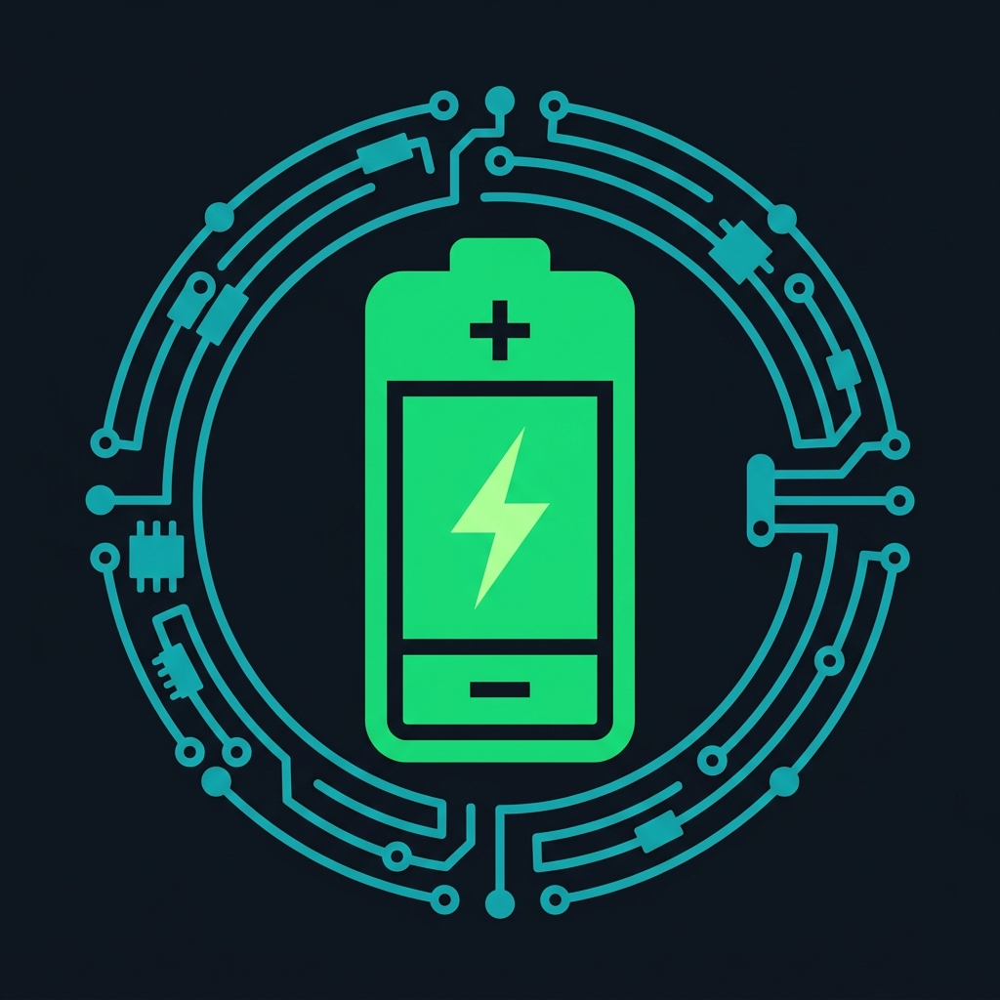

# CP2112 Battery Analyzer

<p align="center">
  
</p>

<p align="center">
  <strong>Standalone desktop application for diagnosing and repairing laptop batteries</strong><br/>
  via the Silicon Labs CP2112 HID-to-SMBus USB adapter and the Smart Battery System (SBS v1.1) protocol.
</p>

<p align="center">
  
  
  
  
  
</p>

---

## 📦 Download

Pre-built binaries are available on the [**Releases**](../../releases) page — no Python installation required.

| Platform | Download |
|----------|----------|
| **Windows 10/11 (64-bit)** | `CP2112-Battery-Analyzer-Windows.exe` |
| **Linux x86\_64** | `CP2112-Battery-Analyzer-Linux` |
| **macOS 12+ (Intel / Apple Silicon)** | `CP2112-Battery-Analyzer-macOS.zip` |

> **Windows driver**: The CP2112 USB driver must be installed separately.  
> Download the Silicon Labs **CP2112 SDK** from: <https://www.silabs.com/developers/usb-to-i2c-bridge?tab=downloads>

---

## ✨ Features

| Category | Details |
|----------|---------|
| **Battery Dashboard** | SOC %, SOH %, pack voltage, current (+/−), average current, power (W), temperature (°C / °F / K) — all live |
| **Cell Voltages** | Individual cell voltages (Cell 1–4) with imbalance delta and balance status badge |
| **Full SBS Register Table** | All 35 Smart Battery Standard v1.1 registers decoded and exportable to CSV |
| **Unseal / Seal** | One-click unseal with built-in key presets for TI BQ20Zxx, BQ30xx, BQ40xx, Sony/Sanyo, Generic |
| **Custom Keys** | Manual hex key input for OEM and custom firmware |
| **Battery Report** | Full diagnostics report (all registers, decoded values, timestamps) exportable to `.txt` |
| **Live Auto-Monitor** | 2-second polling timer for continuous real-time readout |
| **Raw SMBus I/O** | Direct read/write transfers and GPIO latch control |
| **Diagnostics & Logs** | Timestamped activity log exported to file |
| **Connection Guide** | Built-in pinout reference, wake-up procedures, unseal key cheat sheet |

---

## 🚀 Quick Start (pre-built binary)

### Windows
1. Download `CP2112-Battery-Analyzer-Windows.exe` from [Releases](../../releases).
2. Install the **CP2112 USB driver** from Silicon Labs (link above).
3. Double-click the `.exe` — no installation required.

### Linux
```bash
chmod +x CP2112-Battery-Analyzer-Linux
./CP2112-Battery-Analyzer-Linux
```

You may need to add a udev rule so the device is accessible without root:
```bash
echo 'SUBSYSTEM=="hidraw", ATTRS{idVendor}=="10c4", ATTRS{idProduct}=="ea90", MODE="0666"' \
  | sudo tee /etc/udev/rules.d/99-cp2112.rules
sudo udevadm control --reload-rules && sudo udevadm trigger
```

### macOS
1. Unzip `CP2112-Battery-Analyzer-macOS.zip`.
2. Right-click `CP2112-Battery-Analyzer.app` → **Open** (required on first launch to bypass Gatekeeper).

---

## 🛠️ Run from Source

### Requirements

- Python 3.11 or newer
- PySide6 ≥ 6.5
- Windows: Silicon Labs `SLABHIDtoSMBus.dll` + `SLABHIDDevice.dll` (included in `pyreader/`)

### Install dependencies

```bash
pip install -r requirements.txt
```

Or using the Windows `py` launcher:

```bash
py -3 -m pip install -r requirements.txt
```

### Run

```bash
python -m pyreader
```

Or with the `py` launcher:

```bash
py -3 -m pyreader
```

---

## 🔨 Build from Source (PyInstaller)

```bash
pip install pyinstaller
pyinstaller cp2112_analyzer.spec
```

Output is placed in `dist/`:
- `dist/CP2112-Battery-Analyzer.exe` — Windows single-file executable
- `dist/CP2112-Battery-Analyzer` — Linux binary
- `dist/CP2112-Battery-Analyzer.app` — macOS application bundle

---

## 🔌 Hardware Connection

```
CP2112 USB Adapter          Laptop Battery
──────────────────          ──────────────
  SDA  ──────────────────►  SMBus Data  (SDA)
  SCL  ──────────────────►  SMBus Clock (SCL)
  GND  ──────────────────►  Ground      (GND / −)
```

> **Tip:** Use wires shorter than 30 cm. If you see communication errors, add **4.7 kΩ pull-up resistors** on SDA and SCL to 3.3 V or 5 V.

### Waking up a dormant battery

Many laptop batteries enter deep-sleep after extended disconnection. To wake:
- Briefly connect the **System Present** pin (usually Pin 4, labelled `SysPres` or `SMBC`) to GND for ~2 seconds.

### Common SMBus Addresses

| Address | Usage |
|---------|-------|
| `0x0B` (7-bit) / `0x16` (8-bit write) | Standard SBS laptop battery |

---

## 🔓 Unseal Key Reference

| Preset | Key 1 | Key 2 |
|--------|-------|-------|
| TI BQ20Zxx / BQ30xx **(default)** | `0x0414` | `0x3672` |
| TI BQ40xx / BQ2084 | `0x3672` | `0x0414` |
| Generic / Standard firmware | `0x8000` | `0x8000` |
| Sony / Sanyo OEM | `0x1122` | `0x3344` |
| Full access | `0xFFFF` | `0xFFFF` |

To **re-seal** the BMS, write word `0x0020` to `ManufacturerAccess` (register `0x00`), or click **🔒 SEAL BATTERY** in the app.

---

## 📂 Project Structure

```
python/
├── pyreader/
│   ├── __init__.py          # Package init
│   ├── __main__.py          # Entry point (python -m pyreader)
│   ├── main.py              # Full PySide6 GUI application
│   ├── cp2112.py            # CP2112 ctypes wrapper & SBS helpers
│   ├── diag_ui.py           # Minimal Tkinter diagnostics UI
│   ├── icon.ico             # Application icon (Windows / Linux)
│   ├── icon.png             # Application icon (macOS / fallback)
│   ├── SLABHIDtoSMBus.dll   # Silicon Labs HID-SMBus DLL (Windows)
│   └── SLABHIDDevice.dll    # Silicon Labs HID Device DLL (Windows)
├── cp2112_analyzer.spec     # PyInstaller build spec
├── pyproject.toml           # Project metadata & build configuration
├── requirements.txt         # Python dependencies
└── .github/
    └── workflows/
        └── release.yml      # GitHub Actions CI/CD release workflow
```

---

## 🤝 Contributing

Pull requests are welcome. For major changes, please open an issue first to discuss what you would like to change.

---

## 📄 License

MIT — see [LICENSE](LICENSE) for details.
